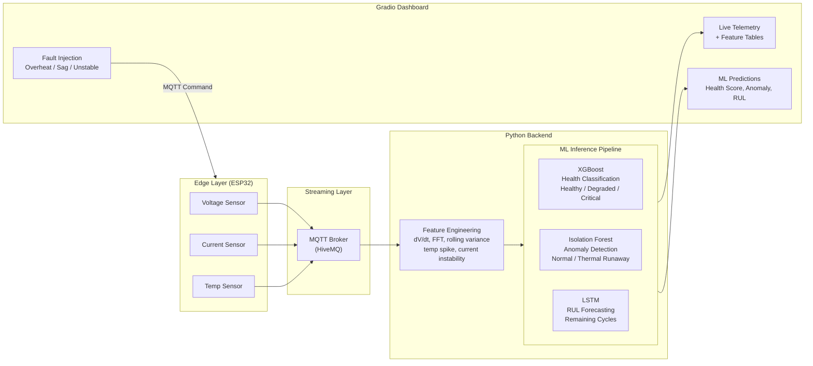

# VoltGuard AI — Battery Telemetry Digital Twin

A real-time predictive maintenance system that monitors lithium-ion battery health using IoT sensor telemetry and machine learning. Built on the NASA Battery Aging Dataset.

## System Flowchart



## ML Models

| Model | Task | Input | Output |
|-------|------|-------|--------|
| XGBoost Classifier | Battery Health State | V, I, T, Cycle | Healthy / Degraded / Critical |
| Isolation Forest | Thermal Anomaly Detection | V, I, T | Normal / Thermal Runaway |
| LSTM (Keras) | Remaining Useful Life | Capacity sequence (10 steps) | Predicted cycles remaining |

## Dashboard Features

- **Hero Landing Page** with project overview and PCB diagram placeholder
- **Dual Data Sources**: Live Wokwi hardware OR NASA dataset replay
- **Dual Live Feeds**: Raw telemetry + extracted features (last 10 readings each)
- **Fault Injection Panel**: 4 fault modes with plain-English explanations
- **Real-time ML Predictions**: Health score, anomaly status, RUL countdown

## Fault Injection Scenarios

| Fault | Effect on Readings | Expected ML Response |
|-------|-------------------|---------------------|
| Thermal Runaway | Temperature → 75-85°C | Isolation Forest: ANOMALY |
| Voltage Sag | Voltage → 0.5-1.5V | XGBoost: CRITICAL |
| Current Instability | Current → -8 to +8A | High instability metric |
| Restore Normal | All readings return to dataset values | All models: NORMAL |

## Quick Start

```bash
# Install dependencies
pip install -r requirements.txt

# Launch dashboard
python src/dashboard.py

# Open http://localhost:7860
# Click "RUN WITH SAMPLE READINGS" to start
```

## Project Structure

```
src/
├── dashboard.py          # Gradio executive dashboard
├── data_simulator.py     # NASA dataset-backed telemetry simulator
├── feature_extractor.py  # Rolling window feature engineering (FFT, dV/dt)
├── colab_training.py     # ML training pipeline (run in Colab)
├── colab_evaluation.py   # Model evaluation and fault verification
└── mqtt_subscriber.py    # Standalone MQTT telemetry monitor

models/
├── xgb_model.pkl         # Trained XGBoost classifier
├── iso_model.pkl         # Trained Isolation Forest
├── iso_scaler.pkl        # MinMaxScaler for anomaly detection
└── lstm_rul_model.keras  # Trained LSTM for RUL prediction

wokwi_simulation/
└── sketch.ino            # ESP32 firmware for Wokwi simulator

discharge.csv             # NASA Battery Aging Dataset (169K records)
```

## Tech Stack

Python, Gradio, TensorFlow/Keras, XGBoost, scikit-learn, MQTT (paho), ESP32 (Wokwi), NASA Battery Dataset
