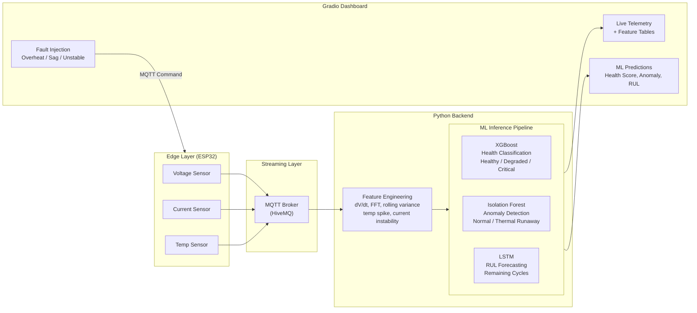

<div align="center">

# VoltGuard
### Battery Telemetry Digital Twin

A real-time predictive maintenance system that monitors lithium-ion battery health using IoT sensor telemetry and machine learning. Built on the NASA Battery Aging Dataset.


</div>

## Project Overview

VoltGuard AI is a comprehensive digital twin designed to monitor, analyze, and predict the health of lithium-ion batteries in real-time. By bridging edge-level IoT sensors with a cloud-based machine learning pipeline, it acts as a proactive early-warning system. Rather than waiting for a battery to fail, VoltGuard continuously analyzes streaming telemetry (voltage, current, and temperature) to catch degradation and thermal anomalies long before they become critical.

This project was built from the ground up using the official **NASA Battery Aging Dataset**, ensuring that the machine learning models are trained on real-world degradation patterns.

## PCB Layout


## The Data Pipeline

The architecture is built for real-time responsiveness. Data originates at the edge layer and flows through a message broker before being processed by the Python backend. The system allows for a bidirectional control loop, meaning the dashboard can actively send commands back to the hardware to simulate faults.



## Machine Learning Architecture

The core of VoltGuard is its three-tiered machine learning pipeline. Rather than relying on a single model, the system uses specialized algorithms for different aspects of battery health monitoring.

| Model | Task | Input | Output | Performance |
|-------|------|-------|--------|-------------|
| **XGBoost Classifier** | Battery Health State | V, I, T, Cycle | Healthy / Degraded / Critical | **97% Accuracy**, 0.96 F1 (Macro) |
| **Isolation Forest** | Thermal Anomaly Detection | V, I, T | Normal / Thermal Runaway | Flags readings outside NASA dataset safe bounds (e.g., T > 42°C) |
| **LSTM (Keras)** | Remaining Useful Life (RUL) | Capacity sequence (10 steps)| Predicted cycles remaining | **MAE: 11.42 cycles**, RMSE: 13.94 cycles |

* **XGBoost Health Classifier**: This model classifies the overall structural health of the battery. By looking at the current operating conditions and the cycle count, it determines if the battery is "Healthy," starting to show wear ("Degraded"), or at risk of immediate failure ("Critical").
* **Isolation Forest**: Designed specifically for safety, this unsupervised anomaly detection model monitors for thermal runaway. It is trained strictly on safe operating ranges; any sudden deviation (like an unnatural temperature spike or erratic current draw) instantly triggers an anomaly alert.
* **LSTM RUL Forecaster**: Built with TensorFlow/Keras, this deep learning sequence model looks at the last 10 capacity readings to understand the trajectory of the battery's degradation, ultimately forecasting exactly how many discharge cycles the battery has left before it dies.

## Interactive Dashboard & Fault Injection

The executive dashboard, built with Gradio, provides a premium dark-mode interface for monitoring the battery. It features dual live feeds showing raw sensor telemetry alongside real-time engineered features (like FFT and rolling variance). 

To demonstrate the system's robustness, the dashboard includes a **Fault Injection Control Panel**. This allows you to intentionally trigger catastrophic events and watch the ML models react in real-time:

1. **Thermal Runaway**: Forces a temperature spike to 75-85°C, instantly triggering the Isolation Forest.
2. **Voltage Sag**: Collapses the voltage down to 0.5V, demonstrating a deep discharge event and forcing the XGBoost model into a "Critical" state.
3. **Current Instability**: Simulates a short circuit or failing BMS by swinging the current wildly, causing the engineered feature pipeline to spike.

## Quick Start

```bash
# Clone the repository and install dependencies
pip install -r requirements.txt

# Launch the interactive dashboard
python src/dashboard.py

# Open your browser to http://localhost:7860
# Click "RUN WITH SAMPLE READINGS" to start the simulation
```

## Project Structure

```
src/
├── dashboard.py          # Gradio executive dashboard application
├── data_simulator.py     # NASA dataset-backed telemetry simulator
├── feature_extractor.py  # Rolling window feature engineering (FFT, dV/dt)
├── colab_training.py     # ML training pipeline (optimized for Colab)
├── colab_evaluation.py   # Model evaluation and fault verification script
└── mqtt_subscriber.py    # Standalone MQTT telemetry monitor

models/
├── xgb_model.pkl         # Trained XGBoost classifier
├── iso_model.pkl         # Trained Isolation Forest
├── iso_scaler.pkl        # MinMaxScaler for anomaly detection bounds
└── lstm_rul_model.keras  # Trained LSTM for RUL prediction

wokwi_simulation/
└── sketch.ino            # ESP32 firmware for Wokwi hardware simulation

discharge.csv             # NASA Battery Aging Dataset (169K records)
```

## Tech Stack

**Language:** Python, C++ (Arduino)  
**Machine Learning:** TensorFlow/Keras, XGBoost, scikit-learn, pandas, numpy  
**Infrastructure & UI:** Gradio, HiveMQ (MQTT), Wokwi (ESP32 Simulation)
